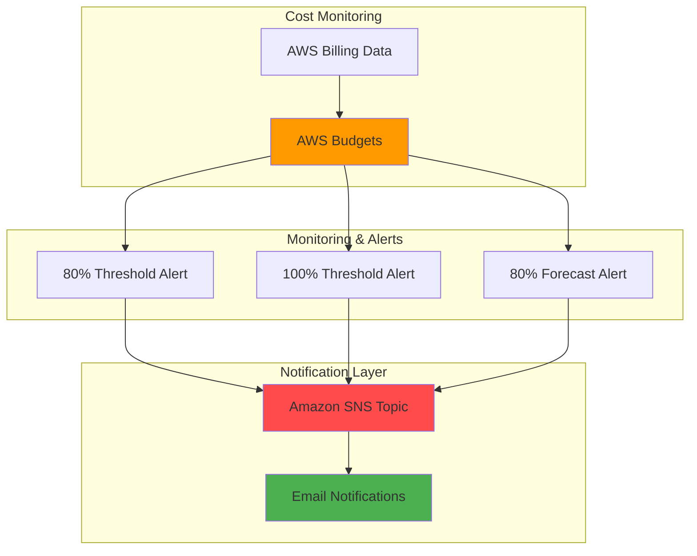

# Budget Monitoring with AWS Budget and SNS

As a student, working with cloud services can be challenging. Forgetting to terminate instances and accumulating credit debt is a real problem I need to actively avoid. Because I'm not on the AWS Console 24/7, using AWS Budgets and SNS seemed like the most practical solution for tracking my service expenses.

This project provides a comprehensive solution by establishing a $100 expenditure limit with 3 different thresholds, when spending exceeds 80%, 100%, and a forecasted 80% limit.

## Architecture Diagram

## Prerequisites
- AWS CLI installed and configured (`aws configure`)
- An AWS Account with permissions for Budgets, SNS, and Secrets Manager
- bash (GNU/Linux environment – `date` commands require GNU coreutils)

## Steps
Run scripts in order or use `build.sh` to run all steps automatically.

1. `00-env.sh` — Setup environment variables, email for SNS subscription, state and config directories.

2. `01-create-sns.sh` — Create SNS Topic.

3. `02-subscribe-sns.sh` — Subscribe to SNS Topic with email provided in `00-env.sh`.

4. `03-budget-config.sh` — Configure Budget's limit, type, time unit, time period and cost types. 

5. `04-notif-config.sh` — Configure notifications for surpassing and forecasted thresholds.

6. `05-build-budget.sh` — Create Budget.

7. `06-verify-budget.sh` — Verify Budget's configuration.

## Testing

1. `email-status.sh` — Verify email subscription status.

2. `test-sns.sh` — Send a test notification through the SNS Topic.

3. `verify-budget-status.sh` — Check Budget's current status.

4. `verify-notif-config.sh` — Check Budget's notification configuration.

## Cleanup
Run `cleanup.sh` to delete the Budget and SNS Topic, and remove local state files.