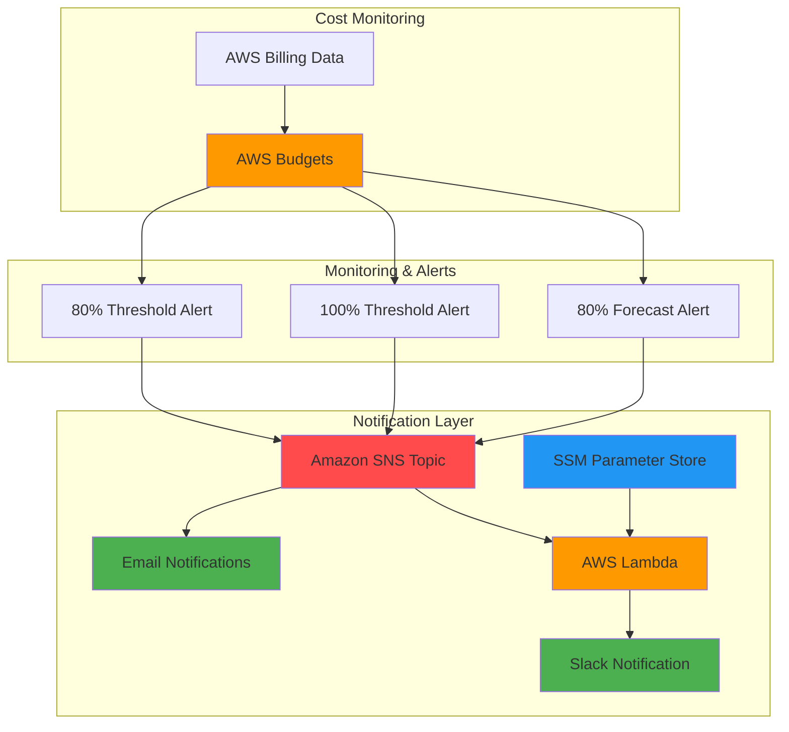

# Budget Monitoring with AWS Budget and SNS

As a student, working with cloud services can be challenging. Forgetting to terminate instances and accumulating credit debt is a real problem I need to actively avoid. Because I'm not on the AWS Console 24/7, using AWS Budgets and SNS seemed like the most practical solution for tracking my service expenses.

This project provides a comprehensive solution by establishing a $100 expenditure limit with 3 different thresholds, when spending exceeds 80%, 100%, and a forecasted 80% limit.

## Architecture Diagram

## Prerequisites
- AWS CLI installed and configured (`aws configure`)
- An AWS account with permissions for Budgets, SNS, Lambda, IAM, SSM, and Secrets Manager
- Python 3.12
- bash (GNU/Linux environment – `date` commands require GNU coreutils)
- A Slack workspace with an incoming webhook URL

## Steps
Run scripts in order or use `build.sh` to run all steps automatically.

1. `00-env.sh` — Setup environment variables, email for SNS subscription, state and config directories.

2. `01-create-sns.sh` — Create SNS Topic.

3. `02-subscribe-sns.sh` — Subscribe to SNS Topic with email provided in `00-env.sh` and wait for confirmation.

4. `03-budget-config.sh` — Configure Budget limit, type, time unit, time period and cost types.

5. `04-notif-config.sh` — Configure notifications for surpassing and forecasted thresholds.

6. `05-build-budget.sh` — Create Budget.

7. `06-verify-budget.sh` — Verify Budget configuration.

8. `07-ssm-webhook.sh` — Store Slack webhook URL in SSM Parameter Store.

9. `08-create-iam.sh` — Create IAM role and policy for Lambda.

10. `09-create-lambda.sh` — Package and deploy Lambda function.

11. `10-update-sns.sh` — Subscribe Lambda to SNS Topic.

## Testing
Run `tests/status.sh` at any time to check for active or leftover resources without affecting the current deployment.

1. `email-status.sh` — Verify email subscription status.

2. `test-sns.sh` — Send a test notification through the SNS Topic.

3. `test-lambda.sh` — Invoke Lambda directly with a mock SNS event and verify Slack notification.

4. `verify-budget-status.sh` — Check Budget current status.

5. `verify-notif-config.sh` — Check Budget notification configuration.

6. `verify-lambda.sh` — Verify Lambda function configuration.

7. `verify-ssm.sh` — Verify SSM parameter exists.

8. `status.sh` — Check for any active or leftover AWS resources.

## Cleanup
Run `cleanup.sh` to delete all AWS resources and remove local state files.